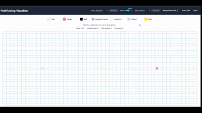
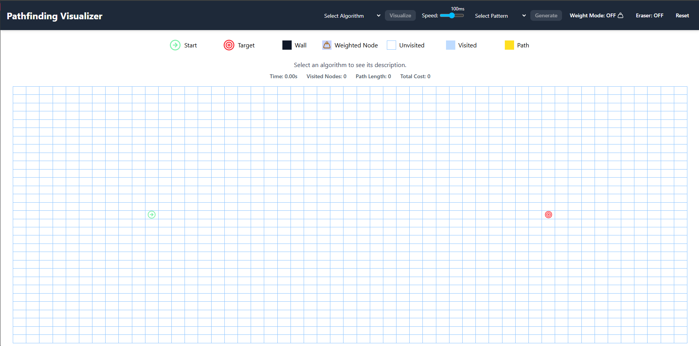
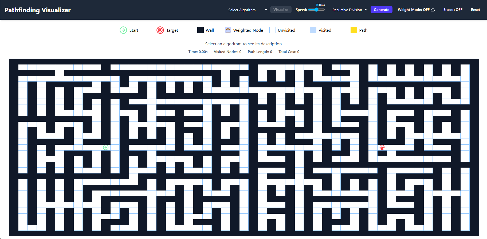
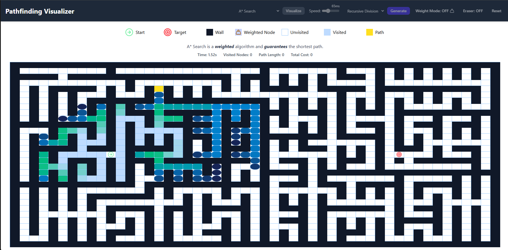
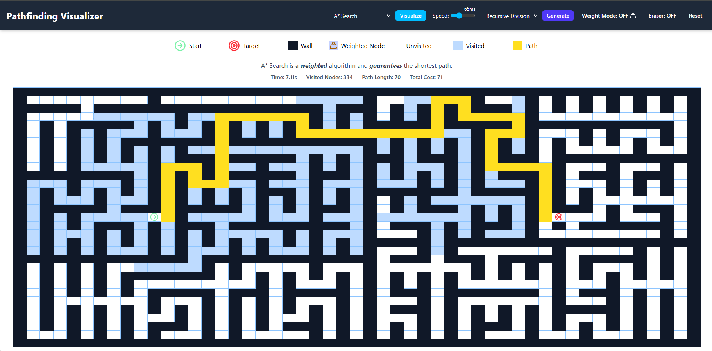

# 🧭 Pathfinding Visualizer

An interactive React-based web app for visualizing popular pathfinding algorithms in real-time. Built to help users understand how algorithms explore and solve problems in grid environments.

View the deployed project [here](https://gmolle.github.io/Pathfinding-Visualizer/)



---

## 🚀 Features

- ⚡ **Real-time Visualization** of:
  - Dijkstra’s Algorithm
  - A\* Search
  - Breadth-First Search (BFS)
  - Depth-First Search (DFS)
  - Greedy Best-First Search
  - Bidirectional BFS
- 🧱 **Maze Generation Patterns**:
  - Recursive Division
  - Horizontal Skew
  - Vertical Skew
  - Random Scatter
  - Weighted Recursive
  - Weighted Scatter
- 🎮 **Interactive Grid**:
  - Drag Start and End Nodes
  - Draw Walls or Weights
  - Toggle Weight Mode and Eraser Mode
- 📊 **Algorithm Metrics**:
  - Runtime (ms)
  - Number of visited nodes
  - Shortest path length
  - Total path cost
- 📈 **Adjustable Speed Slider** for visualizing animations

---

## 🛠️ Tech Stack

- **Frontend**: React, Tailwind CSS
- **Icons**: Lucide
- **Animations**: CSS transitions

---

## 📦 Installation

```bash
# Clone the repository
git clone https://github.com/your-username/pathfinding-visualizer.git
cd pathfinding-visualizer

# Install dependencies
npm install

# Start the development server
npm run dev
Then open your browser and go to http://localhost:5173 to view the application.
```

## 📷 Screenshots

<p>
  
  <br/>
  <em>Default view of visualizer</em>
</p>
<p>
  
  <br/>
  <em>Recursive division maze created</em>
</p>
<p>
  
  <br/>
  <em>A* algorithm in progress</em>
</p>
<p >
  
  <br/>
  <em>A* algorithm solved with path shown</em>
</p>
